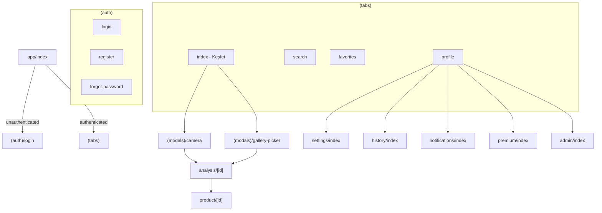

# Nereden? — Architecture

Production-ready mobile app for visual product discovery in the Turkish market.

## Stack

| Layer | Technology |
|-------|------------|
| Framework | React Native + Expo SDK 56 |
| Language | TypeScript (strict) |
| Routing | Expo Router (file-based) |
| Styling | NativeWind v4 + Tailwind CSS |
| Server State | TanStack React Query |
| Client State | Zustand |
| Backend | Spring Boot 3.4 + PostgreSQL (`backend/`) |
| AI | External API service |
| i18n | i18next + react-i18next |

## Clean Architecture

Each feature module follows three layers with dependency inversion:

```
features/{feature}/
├── domain/           # Business rules — no framework imports
│   ├── entities/
│   ├── repositories/ # Interfaces (contracts)
│   └── use-cases/    # Application logic
├── data/             # External data implementations
│   ├── datasources/
│   ├── repositories/ # Concrete implementations
│   └── mappers/      # DTO ↔ Entity mapping
└── presentation/     # UI hooks & components
    ├── hooks/
    └── components/
```

**Dependency rule:** `presentation → domain ← data`. Domain never depends on React, HTTP clients, or Expo.

Screens live in `app/` (Expo Router). They compose presentation hooks/components from `features/`.

## Monorepo Structure

```
nereden/
├── app/                    # React Native screens (Expo Router)
│   ├── (auth)/             # Unauthenticated flows
│   ├── (tabs)/             # Main tab navigator
│   ├── (modals)/           # Camera, gallery picker
│   ├── analysis/[id]       # AI analysis progress
│   ├── product/[id]        # Product results
│   └── ...
├── components/             # Mobile design system
├── features/               # Mobile feature modules
├── services/               # Mobile API clients
├── backend/                # Spring Boot REST API
│   ├── src/main/java/com/nereden/api/
│   │   ├── domain/
│   │   ├── application/
│   │   ├── infrastructure/
│   │   └── presentation/
│   ├── docker-compose.yml
│   └── pom.xml
├── ARCHITECTURE.md
└── ROADMAP.md
```

## Mobile Project Structure

```
app/ components/ features/ services/ hooks/ store/ types/ utils/ constants/ providers/ i18n/ assets/
```

## Navigation Map



## Design System

### Principles
- Minimal white theme with Apple-like spacing and typography
- Rounded cards (`borderRadius: 16–24px`)
- Glassmorphism via `expo-blur` (`GlassCard`)
- Haptic feedback on primary actions
- Full dark mode via `userInterfaceStyle: automatic`

### Tokens
- **Colors:** `constants/colors.ts` — light/dark palettes
- **Typography:** Inter family, display/title/body scale
- **Spacing:** 4px base grid
- **Animation:** 150–400ms, spring configs for Reanimated

### UI Components
`Text`, `Button`, `Card`, `GlassCard`, `Input`, `Badge`, `Skeleton`, `EmptyState`, `ErrorState`

## State Management

| Concern | Tool | Location |
|---------|------|----------|
| Auth session | Zustand | `store/auth.store.ts` |
| Theme preference | Zustand | `store/theme.store.ts` |
| App bootstrap | Zustand | `store/app.store.ts` |
| Server data | React Query | per-feature hooks |
| Form state | Local component state | presentation layer |

## Data Flow (AI Analysis — planned)

```
Camera/Gallery → Upload via REST API (/storage/upload)
              → Create analysis request (/analysis)
              → Poll for result (/analysis/:id)
              → Navigate to product/[id]
```

## Error Handling

- `AppError` hierarchy in `utils/errors.ts`
- `ErrorState` component for recoverable UI errors
- React Query global retry (2x queries, 1x mutations)
- Network timeout: 30s default on `ApiClient`

## Accessibility

- `accessibilityRole` on interactive elements
- `accessibilityLabel` on tab bar and icon buttons
- `accessibilityState` for loading/disabled
- Minimum touch targets: 44×44pt (Button `h-12`+)

## Internationalization

- Default locale: Turkish (`tr`)
- Fallback: `tr`, secondary: `en`
- Device locale detection via `expo-localization`
- All user-facing strings in `i18n/locales/`

## Environment Variables

Copy `.env.example` to `.env`:

```
EXPO_PUBLIC_API_URL=
EXPO_PUBLIC_AI_API_URL=
EXPO_PUBLIC_APP_ENV=development
```

## SOLID Mapping

| Principle | Implementation |
|-----------|----------------|
| Single Responsibility | One use-case per action, one component per UI concern |
| Open/Closed | Repository interfaces allow new data sources without changing domain |
| Liskov Substitution | All repository impls honor domain contracts |
| Interface Segregation | Feature-specific repository interfaces |
| Dependency Inversion | Use-cases depend on abstractions, not HTTP clients |

## Security (planned)

- JWT tabanlı auth (access + refresh token)
- Role-based access: `user`, `premium`, `admin`
- Secure token storage via `expo-secure-store`
- Image upload size limits and MIME validation
- Admin routes gated by `user.role === 'admin'`
